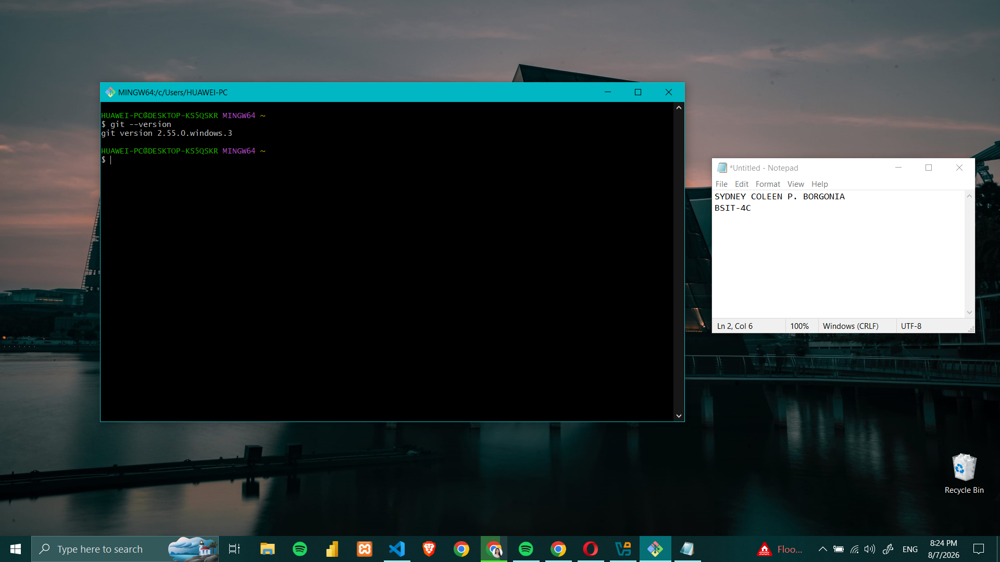
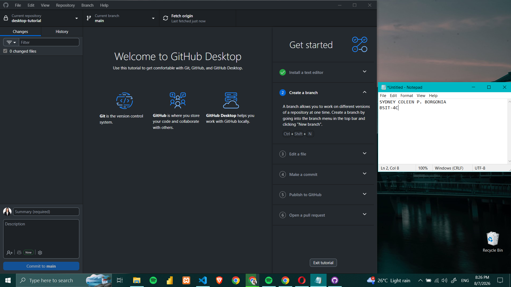
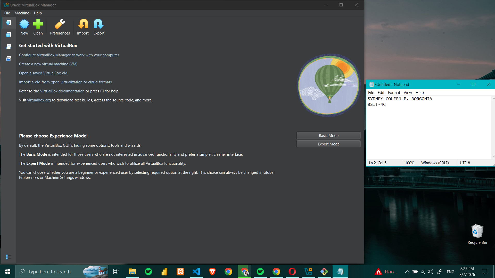
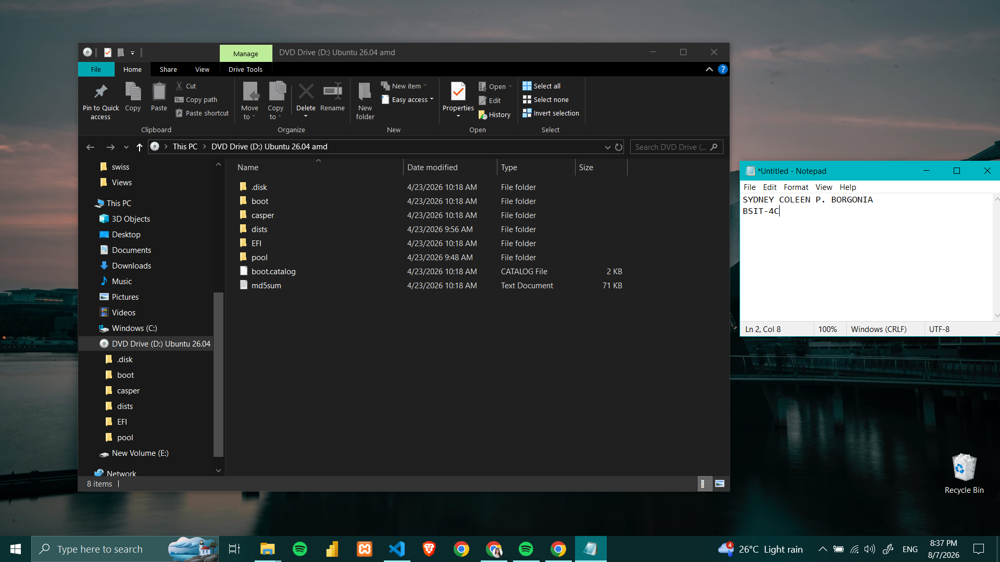

# Week 1 – Building My Professional Environment

## Student Information

- **Name:** Sydney Coleen P. Borgonia
- **Course:** Bachelor of Science in Information Technology
- **Section:** BSIT - 4C
- **Date:** August 7, 2026

## Objectives
- Set up a professional development environment for System Administration and Maintenance.
- Create and configure professional online accounts for academic and portfolio purposes.
- Understand the importance of organizing files and repositories for semester-long activities.

## Software Installed
- Git 
- GitHub Desktop
- VirtualBox
- Ubuntu ISO
- Windows ISO

## Professional Accounts
- **GitHub:** https://github.com/sydneycoleen
- **LinkedIn:** https://linkedin.com/in/sydney-coleen-borgonia-263369378/

## Installation Screenshots
## Git Installation

## GitHub Desktop

## VirtualBox

## Ubuntu ISO Download

## Challenges Encountered
- Configuring GitHub and understanding how repositories work.
- Learning the proper folder structure and Markdown formatting for documentation.
- Organizing screenshots and files inside the repository.

## Reflection
During this activity, I learned how to prepare a professional working environment for my System Administration and Maintenance course. Setting up the necessary software applications, such as Visual Studio Code, Git, and GitHub, allowed me to understand the importance of using industry-standard tools that are commonly used by IT professionals and developers. The installation process also helped me become more familiar with configuring software correctly and ensuring that all tools work together properly for development and documentation purposes.

Creating professional online accounts, especially GitHub, gave me a better understanding of how repositories are used to organize files, manage projects, and maintain version control. I realized that GitHub is not only a storage platform for source code but also a valuable tool for collaboration, portfolio building, and tracking project progress.

Another important lesson I learned was the use of Markdown formatting for creating clean and organized documentation. By editing the README.md file, I practiced using headings, bullet lists, links, and image references, which improved my ability to present technical information in a professional manner.

This activity helped me build a strong foundation for the succeeding laboratory exercises in this course. It improved my technical confidence, enhanced my organizational skills, and prepared me to document future activities systematically throughout the semester while developing a professional portfolio that can showcase my academic and technical growth.

## References
- [Git Official Website](https://git-scm.com/)
- [GitHub Documentation](https://docs.github.com/)
- [GitHub Desktop](https://desktop.github.com/)
- [Oracle VM VirtualBox Downloads](https://www.virtualbox.org/wiki/Downloads)
- [Ubuntu Desktop Download](https://ubuntu.com/download/desktop)
- [Microsoft Evaluation Center – Windows 11 Enterprise](https://www.microsoft.com/evalcenter/)
- [Markdown Guide](https://www.markdownguide.org/)
