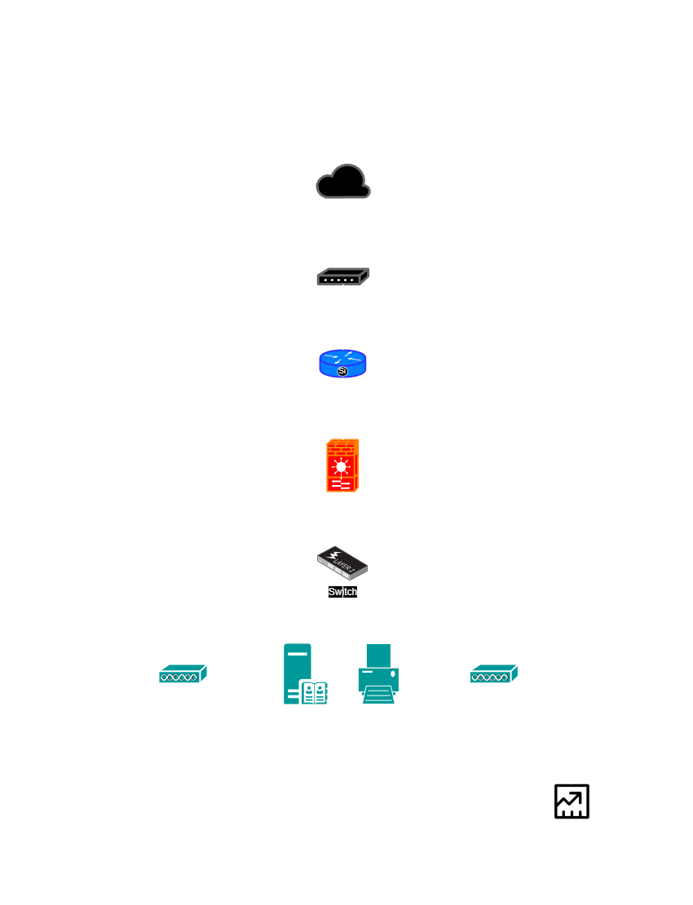

# Week 02 – Enterprise Infrastructure Planning

## Project Overview

Every successful IT infrastructure begins with proper planning. Before purchasing computers, installing servers, configuring networks, or deploying cloud services, a System Administrator must first understand the organization's business requirements and design an infrastructure that supports business operations.

In this project, you will assume the role of a Junior System Administrator assigned to prepare the initial IT Infrastructure Plan of a newly established startup company. 
Your final output should resemble a professional document that could be submitted to an IT Manager or Company Executive.
---

## Learning Objectives
At the end of this project, students should be able to:
Knowledge
- Explain the roles and responsibilities of a System Administrator.
- Identify the hardware, software, and networking requirements of a small business.
- Describe the purpose of IT documentation and infrastructure planning.

Skills
Students will be able to:
- Analyze organizational IT requirements.
- Prepare professional IT inventories.
- Design an enterprise network topology.
- Create technical documentation using Markdown.
- Present infrastructure planning professionally.

Attitude
Students are expected to demonstrate:
- Professionalism
- Organization
- Technical communication
- Attention to detail
- Critical thinking
---

## Company Scenario
You have recently been hired as the Junior System Administrator of ABCStartup Solutions, a newly established software development company.
The company currently has 20 employees and occupies a single office floor. Management has requested that you prepare the complete IT Infrastructure Plan before purchasing equipment.
The company consists of the following departments:
| Department | Employees |
|------------|-----------|
| Information Technology | 5 |
| Human Resources | 4 |
| Finance | 5 |
| Sales | 6 |
| **Total** | **20** |

The company currently has:
- No computers
- No server
- No network
- No internet infrastructure
- No security policies
---

## Hardware Inventory Summary

The proposed infrastructure includes:

- 12 Desktop Computers
- 8 Laptops
- 1 Rack Server
- 1 Business Router
- 1 24-Port Managed Switch
- 2 Network Printers
- 2 UPS Units
- 3 Wireless Access Points
- 1 NAS Storage Device
- 2 External Backup Drives
- 20 Monitors

These resources provide sufficient capacity for the company’s current operations while allowing future expansion.

---

## Software Inventory Summary

The software environment includes:

- Windows 11 Pro for workstations
- Ubuntu Server for centralized services
- Microsoft Office for productivity
- Visual Studio Code for development tasks
- Git and GitHub Desktop for version control
- VirtualBox for virtualization and testing
- Google Chrome for web access
- Microsoft Defender for endpoint security
- AnyDesk for remote support
- 7-Zip for file management and compression

---

## Enterprise Network Diagram

The network topology was designed using **Draw.io (diagrams.net)** and includes the Internet connection, ISP modem, router, firewall, managed switch, wireless access points, server, printer, and all company departments.

### Network Topology

---

## System Administration Roles Covered

- Helpdesk Technician
- Network Administrator
- Linux System Administrator
- Cloud Administrator

Each role includes responsibilities, required skills, common tools, and recommended certifications, as well as an explanation of how these professionals collaborate within an organization.

---

## Infrastructure Recommendations

Key recommendations include:

- Business-grade fiber internet connection
- Dedicated Ubuntu Server for centralized services
- NAS-based daily backups and external backup rotation
- Microsoft Defender endpoint protection
- Strong password policy with multi-factor authentication
- Scalable infrastructure capable of supporting up to 50 employees in the future

---

## Technologies Used

- Git
- GitHub
- Draw.io / diagrams.net
- Markdown Documentation

---

## Challenges Encountered

- Estimating realistic hardware quantities for a startup company
- Designing a logical and secure network topology
- Organizing technical documentation in Markdown format
- Ensuring that all inventories and recommendations were consistent with the company scenario

---

## Reflection

This activity strengthened my understanding of enterprise infrastructure planning, network design, hardware and software inventory management, security considerations, and technical documentation. It also highlighted the importance of planning before deployment to avoid unnecessary costs, improve scalability, and maintain a secure and efficient IT environment.

---

## Project Files

- **Detailed Report:** [EnterpriseInfrastructurePlan.pdf](EnterpriseInfrastructurePlan.pdf)
- **Organizational Structure:** [images/org-structure.png]( images/org-structure.png)
- **Network Diagram PNG:** [diagrams/network-topology.png](diagrams/network-topology.png)
- **Network Diagram PDF:** [diagrams/network-topology.pdf](diagrams/network-topology.pdf)

---

## References

- [Git Official Website](https://git-scm.com/)
- [GitHub Documentation](https://docs.github.com/)
- [Draw.io / diagrams.net](https://www.diagrams.net/)
- [Microsoft Defender Documentation](https://learn.microsoft.com/microsoft-365/security/defender-endpoint/)

---
