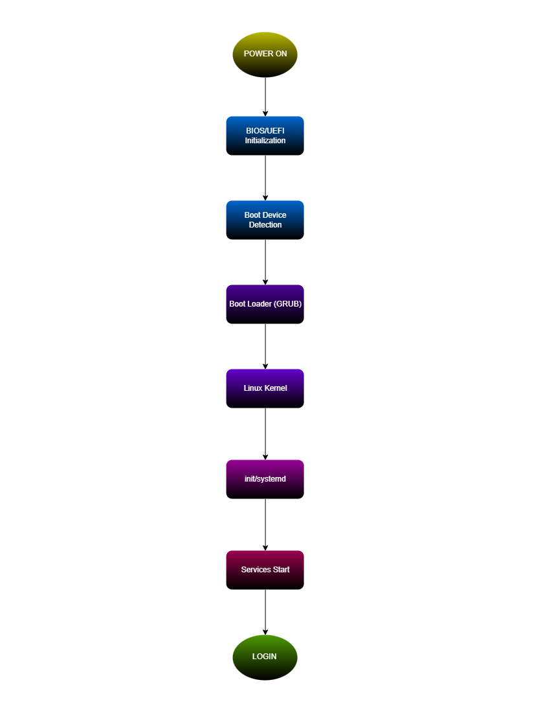

# Week 03 – Enterprise Server Deployment and Operating System Installation

## Project Overview

Operating Systems serve as the foundation of every enterprise IT infrastructure. Before a server can host websites, databases, cloud services, or enterprise applications, it must first be properly installed, configured, secured, and documented.

In this project, I assumed the role of a **Junior System Administrator** responsible for deploying a new **Ubuntu Server** for a startup company. The project involved performing a complete operating system installation, configuring essential settings, verifying the installation, comparing modern boot technologies, and creating professional documentation suitable for future administrators.

The deliverables from this project form part of my **professional GitHub portfolio** for the **System Administration and Maintenance** course.

---

## Learning Objectives

### Knowledge

After completing this project, students should be able to:

* Explain the purpose of an operating system in enterprise environments.
* Differentiate BIOS and UEFI firmware.
* Explain the stages of the computer boot process.
* Compare Ubuntu Server, Windows Server, and Rocky Linux.

### Skills

Students should be able to:

* Install Ubuntu Server in a virtual machine.
* Configure server settings during installation.
* Enable secure remote administration using **SSH**.
* Verify server functionality.
* Document installation procedures.
* Produce professional technical documentation.

---

## Virtual Machine Specifications

### Ubuntu Server VM

| Component     | Specification               |
| ------------- | --------------------------- |
| VM Name       | Ubuntu-Server-Week03        |
| RAM           | 4 GB                        |
| CPU           | 2 Virtual Processors        |
| Storage       | 40 GB VDI                   |
| Network       | NAT                         |
| Optical Drive | Ubuntu Server 24.04 LTS ISO |

### Windows Server VM

| Component     | Specification                      |
| ------------- | ---------------------------------- |
| VM Name       | Windows-Server-Week03              |
| RAM           | 4 GB                               |
| CPU           | 2 Virtual Processors               |
| Storage       | 50 GB VDI                          |
| Network       | NAT                                |
| Optical Drive | Windows Server 2022 Evaluation ISO |

---

## Installation Summary

### Ubuntu Server Installation

* Created a new Linux virtual machine in **Oracle VirtualBox**.
* Attached the Ubuntu Server ISO.
* Configured language, keyboard layout, hostname, and user account.
* Used **Guided – Use Entire Disk** with the **ext4** file system.
* Enabled **OpenSSH Server** during installation.
* Completed the installation and rebooted successfully.

### Windows Server Installation

* Created a new Windows virtual machine.
* Attached the Windows Server 2022 Evaluation ISO.
* Selected **Windows Server 2022 Standard Evaluation (Desktop Experience)**.
* Performed a **Custom** installation.
* Configured the **Administrator** password.
* Renamed the computer to **SERVER01-WS**.
* Logged in successfully after reboot.

---

## Configuration Summary

| Setting               | Value       |
| --------------------- | ----------- |
| Hostname              | server01    |
| Username              | sydneycoleen|
| File System           | ext4        |
| Network Mode          | NAT         |
| SSH Server            | Enabled     |
| Package Manager       | APT         |
| Windows Computer Name | SERVER01-WS |

---

## Verification Results

The following verification procedures were completed successfully:

| Verification Task          | Command                | Result                      |
| -------------------------- | ---------------------- | --------------------------- |
| Verify hostname            | `hostname`             | `server01`                  |
| Verify IP address          | `ip addr`              | Valid DHCP address assigned |
| Test internet connectivity | `ping -c 4 google.com` | Successful replies received |
| Update repositories        | `sudo apt update`      | Completed successfully      |
| Upgrade packages           | `sudo apt upgrade -y`  | Completed successfully      |
| Verify SSH service         | `systemctl status ssh` | `active (running)`          |

These results confirmed that the Ubuntu Server installation was functioning correctly and was ready for further administration tasks.

---

## BIOS vs UEFI Highlights

| Feature              | BIOS           | UEFI                         |
| -------------------- | -------------- | ---------------------------- |
| Boot Architecture    | 16-bit         | 32/64-bit                    |
| Partition Style      | MBR            | GPT                          |
| Maximum Disk Support | Up to 2 TB     | More than 2 TB               |
| Security             | Limited        | Secure Boot support          |
| Boot Speed           | Slower         | Faster                       |
| Modern Usage         | Legacy systems | Modern computers and servers |

### Key Takeaway

UEFI has become the modern standard because it provides faster boot times, GPT support, Secure Boot security, larger disk support, and better compatibility with modern hardware and virtualization platforms.

---

## Embedded Boot Process Flowchart

---

## Challenges Encountered

Several technical issues were encountered during the deployment process:

| Challenge                                      | Resolution                                                                            |
| ---------------------------------------------- | ------------------------------------------------------------------------------------- |
| `Failed to fetch` during `apt update`          | Changed the Ubuntu mirror from `ph.archive.ubuntu.com` to `archive.ubuntu.com`.       |
| `google.com: Name or service not known`        | Verified NAT networking and tested connectivity using `ping 8.8.8.8`.                 |
| `ssh.service could not be found`               | Installed OpenSSH Server manually using `sudo apt install openssh-server -y`.         |
| VM booted back into the installer after reboot | Removed the installation ISO from **Devices → Optical Drives** before restarting.     |
| Difficulty taking screenshots in VirtualBox    | Used **Machine → Take Screenshot** and organized images in the `screenshots/` folder. |

---

## Reflection

This Week 3 activity provided valuable hands-on experience in virtualization, Linux administration, and server deployment. Through the Ubuntu Server installation process, I learned how enterprise-style server deployments differ from regular desktop installations, particularly in terms of hostname configuration, disk partitioning, network setup, and SSH management.

One of the most important lessons I learned was the value of systematic troubleshooting. Encountering repository errors, DNS resolution problems, and missing SSH services initially made the installation process challenging. By verifying network connectivity, checking repository configurations, and using Linux administrative commands, I was able to identify the root causes and resolve the issues successfully.

Installing Windows Server 2022 Evaluation also helped me understand the differences between Linux and Windows server environments. Ubuntu Server emphasized command-line administration, lightweight performance, and open-source flexibility, while Windows Server provided graphical management tools, centralized administration features, and integration with Microsoft enterprise services.

The BIOS vs UEFI comparison and the Ubuntu boot process flowchart further strengthened my understanding of how a computer starts, initializes hardware, loads the bootloader, and launches the operating system. Overall, this project improved my skills in **system administration, virtualization, troubleshooting, technical documentation, and professional IT workflow preparation**, which are essential competencies for a future BSIT professional.

---

## Project Files

* **Installation Guide:** [InstallationGuide.pdf](InstallationGuide.pdf)
* **Professional Installation Manual:** [ProfessionalInstallationManual.pdf](ProfessionalInstallationManual.pdf)
* **BIOS vs UEFI Comparison:** [BIOS_vs_UEFI_&_OS_Comparison_Report.pdf](BIOS_vs_UEFI_&_OS_Comparison_Report.pdf)
* **Boot Process Flowchart PDF:** [BootProcessFlowchart.pdf](BootProcessFlowchart.pdf)
* **Boot Process Flowchart PNG:** [diagrams/BootProcessFlowchart.png](diagrams/BootProcessFlowchart.png)

---

## References

* [Ubuntu Server Documentation](https://ubuntu.com/server/docs)
* [Oracle VirtualBox User Manual](https://www.virtualbox.org/manual/)
* [Microsoft Learn – Windows Server Documentation](https://learn.microsoft.com/windows-server/)
* [Draw.io / diagrams.net](https://www.diagrams.net/)
* [Red Hat Enterprise Linux Documentation](https://access.redhat.com/documentation/)

---

